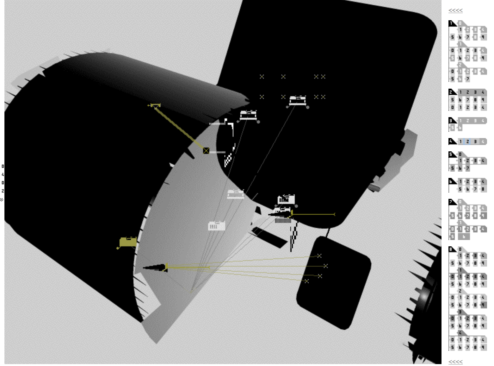
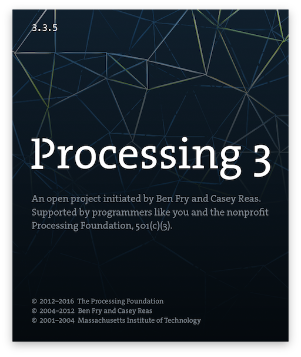
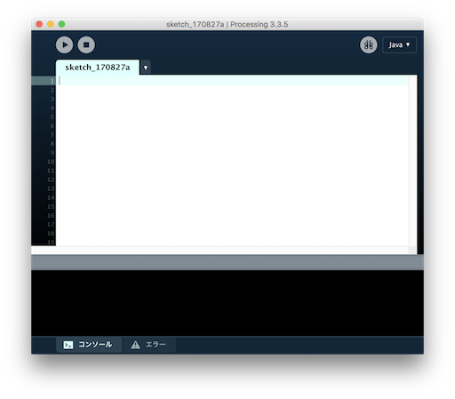

# 後期映像表現演習1-1 

### この講義の概要と目標

この講義では、Processingというプログラミングによってコンピュータグラフィックを行うためのソフトウエアを使って、簡単な図形から初め、コンピューターで映像表現を行うための基礎的な考え方を学びます。

二週目以降は徐々に応用に触れ、プログラミングの作法なども同時に学んでいきます。最終的にはProessingを用いて、独自の映像表現を行えるようになることを目指します。

## コンピュターによるグラフィック表現

コンピューターの黎明期1952年ベン・F・ラポスキーがオシロスコープでブラウン管に曲線を描いたのが最初のグラフィック表現とされています。
しかしその後のXYプロッターが登場して初めてコンピューターグラフィックの表現ができるようになりました。
ドットマトリックスプリンターやインクジェットプリンター、液晶ディスプレイなど様々な表示装置がコンピューターの表示に使われ始めそれぞれの装置の制約が表現方法を規定してきた歴史でもあります。

### 河野洋

60年代からコンピューターによる美学を研究、コンピューターアートを支える概念「計算美学」の提唱者。早くから　画像は2006年制作のSimulated Color Mosaic

imafe from: [http://dm.jagda.or.jp/70s/](http://dm.jagda.or.jp/70s/)

### CTG（コンピュータ・テクニック・グループ）

60~70年代、多摩美プロダクトデザインの幸村真佐男、東京大学大学院の槌屋治紀らによるグループCTGよりによる作品。当時のコンピューターは中央メンフレームワークコンピューターで使用するにも大変高額な費用がかかりため一般で使うことは大変難しかった。日本IBMの協力を得て作成していた。

1968 KNDY

image from: [http://kohmura.org/ctgworks.html](http://kohmura.org/ctgworks.html)

1968年 Running Cola is Africa!

image from: [http://kohmura.org/ctgimage/RUNNING.JPG](http://kohmura.org/ctgworks.html)

### ジョン前田

ジョン前田が日本滞在中（筑波大学大学院生）に施作したポスター。タイポグラフィーによるジェネレティブデザインのアイディアに溢れている。

1996年 モリサワポスター

image from : [https://maedastudio.com/morisawa-10-2016/](https://maedastudio.com/morisawa-10-2016/)

### Dextro / Turux.org

オーストリアのWalter Gorgosilitsによるプロジェクト。Flashの前進であるMacromedia Director（Lingoという言語によりアニメーションを制作できるだけでなくサウンドも扱えた)によって平面のデザインだけではく、オーディオとグラフィックを合わせたダイナミックなデザインをweb上で体験できる形で公開していた。

[Dextro.org](http://dextro.org)

[Turux.org](http://turux.org/turux_alt/index.html) ([キャプチャー画像](./capture.md))

### 中村勇吾

モリサワフォントパーク 2008年

日本でインタラクションザインを広めた開発者yugop (現tha ltd.)Flashによるグラフイカルで洗練された作品を多数残す。2000年代のウェブサイト上のインフォメーションデザインを牽引した。

Visual Complexity:

[モリサワフォントパーク](http://fontpark.morisawa.co.jp/)　*要Flash Playerプラグイン

[https://www.youtube.com/watch?v=I0HR7TeY5jo](https://www.youtube.com/watch?v=I0HR7TeY5jo)

[ttp://tha.jp](http://tha.jp)

### Mike Bostock

Mike Bostockは

[https://bost.ocks.org/mike/](https://bost.ocks.org/mike/)

[Newyork Times 2016: The Year in Visual Stories and Graphics](https://www.nytimes.com/interactive/2016/12/28/us/year-in-interactive-graphics.html)

## Processingとは

- Ben Fry と Casey Reas によって2001年に開発が始まった。

- エンジニアではなく、アーティストやデザイナーのためのプログラミング言語。（インタラクティブ／ジェネレティブデザイン・アート）様々なアートやデザインのプロジェクトに使われている。

- すぐに実行できる、確かめる。トライアンドエラーのサイクルの短さ。

- プリミティブな描画を行うためのメソッドが用意されており、OpenGLなどの低級なAPIを知らなくとも、簡単にコンピューターグラフィクスを始められる。

- Javaがベースのインタプリター言語、今では Linux Windows OSX 各プラトフォームに対応。

- 自由にダウンロードできる／オープンソース [https://github.com/processing](https://github.com/processing)

### 作例

[gallery of computation by JARED TARBELL](http://www.complexification.net/gallery/)

[Shadow Monsters by Philip Worthington](https://www.moma.org/calendar/exhibitions/1321)

[MIT MEDIA LAB Visual Identity](http://www.thegreeneyl.com/mit-media-lab-identity-1)

[https://processing.org/exhibition/](https://processing.org/exhibition/) に多くの作例が

## その他よくクリエイティブコーディングに使われるライブラリー

### d3.js

Mike Bostock氏がメインコントリビューターのデータヴィジュアライゼーションのためのJavaScriptライブラリー。D3は(Data-Driven Documents)の意味。

[https://d3js.org](https://d3js.org)
	
### three.js

Mr.Doob氏がメインで開発されている3D描画のためのJavaScriptライブラリー。今では最も人気のWebGLのためのライブラリーとなった。
	
[three.js](https://threejs.org)
	
### openFrameworks

C++のクリエイティブコーディングのためのライブラリー。Processing同様様々なアート／デザインプロジェクトに使われている。
 
 [http://openframeworks.cc/ja/](http://openframeworks.cc/ja/)

## 書籍

- [Processing, Secwond Edition](https://mitpress.mit.edu/books/processing-0)

- [Visualizing Data](http://shop.oreilly.com/product/9780596514556.do)

- [Visual Complexity: Mapping Patterns of Information](http://www.visualcomplexity.com/vc/) [Amazon](http://amzn.asia/aHteDzn)

- [Generative Design](http://amzn.asia/eFiCQNT)