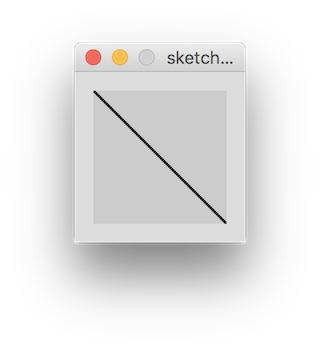
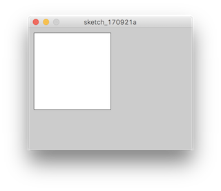
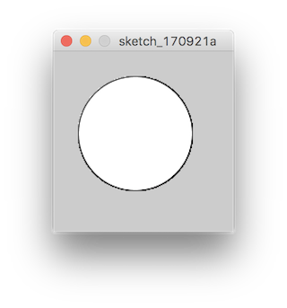
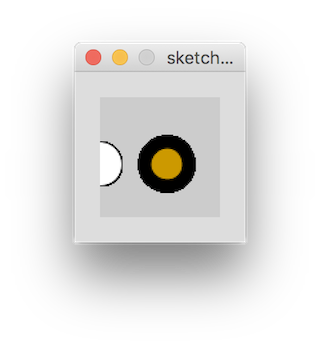

# 後期映像表現演習1-2

## 図形の描画

Processingには様々なプリミティブな図形を書くための関数が多く用意されているので、すぐにコンピューターグラフィクス(CG)を始められます。まずは標準的な描画関数から初めて、徐々にそれらを組み合わせて複雑なグラフィックを描くための基礎を学びましょう。


#### ヘルプリ／ファレンス

Processingや他のプログラミング言語にもたいていの場合、説明書が用意されています。文法、関数やクラスなど数千に及ぶオブジェクトを覚えておくのは不可能です。なので、開発する人のために参照となる説明書が必ずあります。Processingの場合、公式のwebsiteにあります｡

[https://processing.org/reference/](https://processing.org/reference/)

関数について使い方がわからないときは常にここを見て確認するようにしましょう。

### 初期化

多くのプログラミングでは初期化という、そのプログラムで使うためのオブジェクトと呼ばれる材料を用意するための下準備を行います。Processingの場合、Runボタンを押した時にまず初めに行われる処理を書いておくための```setup()```という関数が用意されています。

```
void setup() {
	// 初期化の処理...
} 
```

このニョロカッコ{}内（スコープと言います）に書いておくことでRunボタンを押して、プログラムを走らせた時、最初に一回だけ行われます。

では画面サイズを指定する```size()```関数を書いて画面のサイズを変えて見ましょう。

```
void setup() {
	size(640, 480);
}
```

Runボタンを押して走らせて見ます。

### draw

次はいよいよ、プログラムの内容を書く部分、Processingでは主に描画のプログラムを行うため```draw()```という
関数に書きます。


```
void draw() {
} 
```

この```draw```関数内に書いた処理は毎秒数十回のペースで繰り返し呼び出されます。
多くのコマアニメーションと同じ原理でCGプログラミングも素早く絵を切り替えることで動くように見せていますが、これはCGの場合も同じで、素早く静止画を送ることで動いているように見せます。```draw```関数には一コマで行われ流処理を、上から順番に書いておくことでアニメーションとして表現されます。アニメーションについては後ほど触れます。

### 線（Path）



まず簡単に直線を引いて見ましょう。

```line(fromX, fromY, x, y);```


```
void draw() {
	line(0, 0, 120, 120);
} 
```


### ループ

コンピューターの処理で一番大事なループを使ってたくさんの描画処理をして見ましょう。コンピューターの処理は高速です、あなたが線を一本書くのよりもっと高速にもっと多区の線を描けます。この処理にもループと呼ばれる処理が使われます。コンピューターで何かを表現する時に繰り返ししょ処理は、最大のアドバンテージとなるでしょう。

基本となる```for```を使ったループを書いて見ましょう。

```
for (int i = 0; i < numLoop; i++) {
	// 繰り返したい処理...
}
```

```i```は繰り返す処理の中で利用できる変数でカウンタ変数と言います。2番目の引数、ここはループを続ける条件式を書きます。```i``` が ```numLoop```よりも大きくなるとループから抜け出し、繰り返し処理が終わります。for後の丸括弧の3番目、```i++```に注目しましょう。
ここでカウンタ変数の更新を行います。++は１加算（インクリメント）するといういう意味です。繰り返しの処理が終わるごとに変数内の数字に1ずつ足す処理をしています。

カウンタ変数iを使って線をたくさん引いて見ましょうnumLoopは繰り返したい回数を意味します。100回繰り返して見ましょう。

```
for (int i = 0; i < 100; i++) {
	line(i * 2 + 120, 120, i * 6, 320);
}
```

200回、1000回と増やして見ましょう。

線の太さを変えたくなりました。```strokeWeight()```関数を使って線の太さを指定しましょう。

```
strokeWeight(weight);
```

### 色の指定

線の太さだけでなく、線の色も変えたくなりました。```stroke()```関数でいを路を指定しましょう。

```
stroke(r, g, b, a);
```

コンピューターでの色の空間の表現はr(赤),g(緑),b(青)の色素をビット震度で割って表現します。よく云われる8bitとは2の8乗、0~255で何かを表現することを言います。Processingや他の多くのCGプログラミングでも各色素を256段階で表現します。また指定する4つ目の値a(アルファで透明度を指定できます。Processingではこれも0-255で指定します。

### 矩形



```rect()```関数で、矩形を書きます。

引数は ```rect(x, y, width, height)```


### 円



```ellipse()```関数で、円を書きましょう。

引数は ```ellipse(x, y, width, height)```

### 背景色

背景色を変えます。

```
background(r, g, b, a);
```

### 塗りつぶす

```fill()```を使います。色の指定は```background ```の時と同じです。
塗りつぶしたい図形を描く直前の行で指定します。

*スタイルの演算はプリミティブ関数の直前是呼びます。それ位このスコープ内ではそのスタイルが適用されるようになります。

### 線の色

同じような方法で```stroke()```で指定します。

### 線の太さ

```strokeWeight()```

### pushStyle / popStyle 

指定した色や線の太さなどの指定は、コンテキストが続く限り影響します。
```pushStyle ``` / ```popStyle ```はそのコンテキストを階層化して、部分適用させるのに役立ちます。

```
background(255, 255, 255);
  
  strokeWeight(1);
  stroke(255, 0, 0);
  fill(255, 0, 0);
  
  ellipse(50, 50, 30, 40);
  
  pushStyle();
    strokeWeight(1);
    stroke(255, 255, 0);
    fill(255, 255, 0);
   
    rect(60, 60, 30, 40);
  popStyle();
  
  line(0, 0, 120, 120);
```




```
ellipse(0, 50, 33, 33);  // Left circle

pushStyle();  // Start a new style
strokeWeight(10);
fill(204, 153, 0);
ellipse(50, 50, 33, 33);  // Middle circle
popStyle();  // Restore original style
```
*リファレンスサンプルコードより


## アニメーション

これまで描いた図形は```draw```関数内で繰り返しを使っているもの、各フレームでは変化がないため、動いていませんでした。フレームごとの変化を出して、アニメーションをさせて見ましょう。

再び```draw()```関数に注目してみると、この関数のスコープは```for```の時のように繰り返し呼ばれています。iのような外部からの変数を用いれば繰り返しの変化を表現できそうです。

外部に	変数を用意して、```draw()```のスコープ内でインクリメントして見ましょう。

```
int frameNum = 0; // 変数を用意して0で初期化

void draw() {
	// 描画の処理
	frameNum++; // 処理の最後でframeNumをインクリメント
}
```

frameNum変数を使って図形を動かして見ましょう。

毎フレーム書いたものが残ってしまうので、画面を```draw()```関数の初めで消して見ます、```background()```を指定すると消せます。

## インタラクション

Processingはインタラクティブなプログラムを組むことができます。
最初に考えられるものとしてコンピューターに接続されているマウスと、キーボードのからの入力です。

### マウス

```mouseX()``` ```mouseY()```

でマウスポインタの座標が、

```mousePressed```

変数で、マウスが押されているかどうかが判定できます。

### 条件文

プログラミングでは処理の流れを条件によって分けたい時があります。代表的なif文を使って処理を分けて見ましょう。

```
if (keyPressed) {
	print('key is pressed!');
	print(key);
} else {
	print('key is not pressed..');
}
```

```if```の最初の丸括弧内に```()```[条件式](#条件式)を書きます。もしその条件がtrue(真)になる場合次のニョロカッコ内のスコープの処理が行われます。
もし条件が偽(false)になる場合スキップされて処理は行われません。

```else```は条件式が偽(false)の時に処理されるスコープです。

上の例は```keyPressed```が```true```の場合上のニョロカッコ内、```false```の時に```else```文の中の処理が行われます。


### キーボード入力

```
if (keyPressed) {
	print(key);
	
   if (key == 'x') {
		print("x pressed");	
    }
}
```


簡単なドローイングプログラムを作って見てください。

### 条件式

代表的な条件式

```==``` equal to

```
1 == 2
```

左辺と右辺が等しい

```!=``` not equal to

左辺と右辺が等しくない

```
2 != 1
```

```<``` less than

左辺が右辺より小さい（未満）

``` 
-1 < 0
```

```>``` greater than

左辺が右辺より大きい（超える）

```
0 > -1
```

```<=``` less than or equal to

左辺が右辺以下

```
1 <= 0
```

```>=``` greater than or equal to

左辺が右辺以上

```
1 >= 0
```


```&&``` logical and

左辺かつ右辺が真

```
2 > 0 && -1 < 1
```

```||``` logical or

左辺もしくは右辺が真

```
-2 < 1 || 2 > 1
```

```!``` logical not

条件の逆の時

```
!(1 < 0)
```

