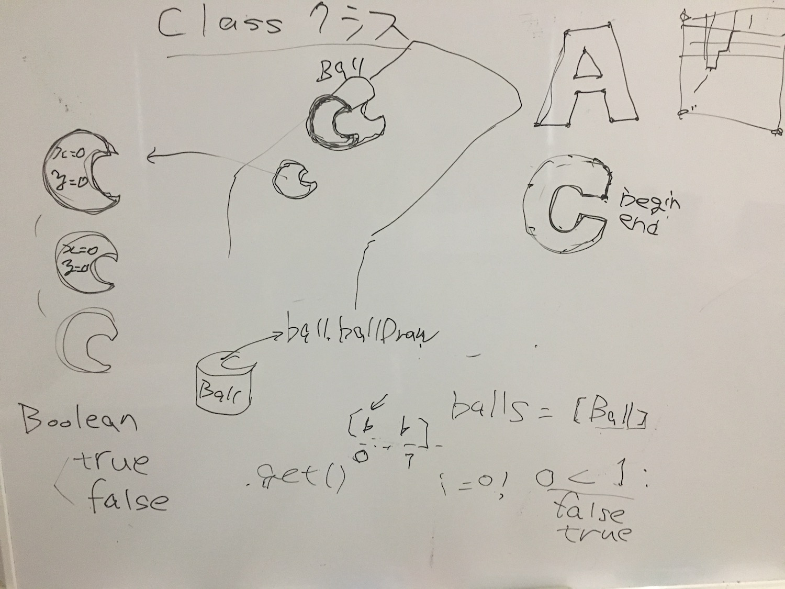

# 後期映像表現演習1-3

## 文字の描画・タイポグラフィー

### PFont

CGでの文字の描画には大きく分けて二種類あると言えます。一つはビットマップフォント(Bitmap Font)、
これは文字を矩形のテクスチャにして、平面に貼り付ける方法。もうひとつはパスフォント(Path Font)、文字の輪郭をベクターのパスの集合として描く方法です。Processingではフォントデータを使いやすく準備するための```PFont```というクラスがあります。今回もこれを使って描画して言いましょう。

#### ビットマップフォント

文字をビットマップに投影してテクスチャーにしてから、平面のジオメトリに貼り付けて表示する方法。
拡大していくとテクスチャーが小さい場合に眠く見えたりする。遠目ではアンチエイリアスにより綺麗に見えたりする。


#### シェイプでのフォント

パスの情報を持っているので、複雑な文字の場合は描画の計算コストが跳ね上がってしまう。
図形（シェイプ）として処理できる。拡大しても綺麗。


### 普通に書いてみる

まずフォントファイルを用意します。

SourceCodeProフォント : [https://github.com/google/fonts/tree/master/ofl/sourcecodepro](https://github.com/google/fonts/tree/master/ofl/sourcecodepro)


PFontではテクスチャフォントになります。

```
PFont font;

void setup() {
  font = createFont("SourceCodePro-Regular.ttf", 20);
  size(640, 480);
}

void draw() {
  textFont(font);
  text("Hello World!!", 10, 50);
}

```

フォントデーターを自動的にテクスチャフォントに変換してくれる```createFont()```関数を使い、

描画に```text()```関数を用います。


### PShapeとしてパスを描く

一度PFontをPShapepブジェクトにしてから使います。

```
PFont font;

void setup() {
  font = createFont("SourceCodePro-Regular.ttf", 120);
  size(640, 480);
}

void draw() {
  PShape textShape = font.getShape('F', 1);
  
  textShape.beginShape();
  textShape.strokeWeight(1);
  textShape.stroke(255);
  textShape.noFill();
  textShape.endShape();
  
  shape(textShape, 120, 120);
}
```

### 1017/10/05 板書


