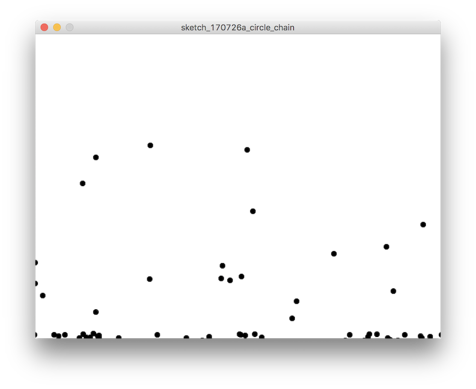
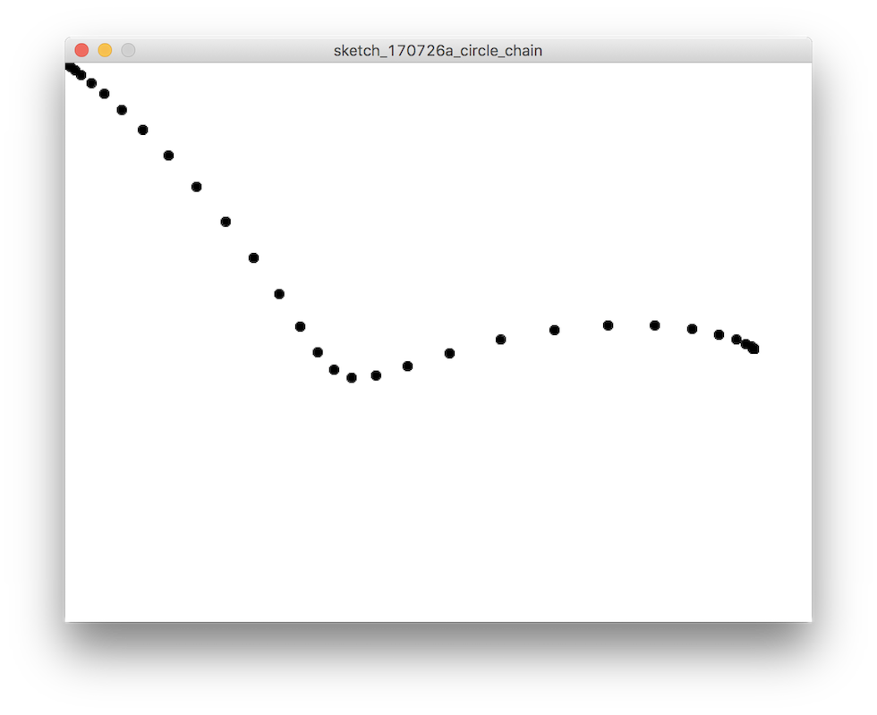

# 後期映像表現演習1-4

## シンプルな物理モデル

前回ではフレームごとに違う変数を使用することでアニメーション表現をしました。
今回もう少し進めて自然界の現象をシミュレートした物理モデルを使って物の質感を動きで表現して見ましょう。

## 重力加速度



物理の授業で習う基本の重力加速度ですが、これをシュミレートしてアニメーション表現に取り入れて見ましょう。
まずは2Dの空間で、物体に常に重力加速度を加えて見ます。

前回までは単純に手続きに従って描画をしてきましたが、ここでオブジェクト思考プログラミングの基本構造の一つ”クラス”を使って丸いボールを表現してみます。クラス化することで、ベクトルの計算も簡単に組めるようになります。

### Class

オブジェクト指向プログラミングでは、複雑な振る舞いや状態をまとめて抽象化するClass(クラス)という方法が用いられます。それでは早速クラスを作ってみましょう。

```
class Ball{
}
```

クラスにはそのオブジェクトに必要な変数や関数をニョロかっこ```{}```の中に書いていきます。

まずはベクトルの状態を計算するのに必要な変数を用意しましょうボールのいま座標を```x``` ```y```ボールにかかっている加速度を```xspeed``` ```yspeed```とでもしておきます。*これをメンバ変数と言います。

```
class Ball{
	float x, y;
	float xspeed, yspeed;
}
```

次にコンストラクタと呼ばれるオブジェクトの変数を初期化するための特別な関数を書きます。これはオブジェクトが作られるときに一度呼ばれます。

```
class Ball{
	float x, y;
  	float xspeed, yspeed;
	Ball() {
    	x = mouseX;
   		y = mouseY;
    
    	xspeed = 0.0; 
    	yspeed = 0.0;
  }
}
```

次にボールの毎フレームの処理として```draw()```関数を用意します。

```
class Ball{
	float x, y;
  	float xspeed, yspeed;
	Ball() {
    	x = width / 2;
   		y = 0;
    
    	xspeed = 0.0; 
    	yspeed = 0.0;
  	}
	void draw() {
    	stroke(0);
    	fill(0);
    	ellipse(x, y, 10, 10);
    	y += yspeed;
    	x += xspeed;
  }
```

これでボールの準備はできました。

### 配列

```
ArrayList balls = new ArrayList();
```

ボールたちを格納する配列として```ArrayList```を用いて```balls```を用意します。これを後で```for```ループで回してそれぞれのボールたちに同じ計算をさせて効率よくアニメーションさせます。
この配列とループを使用してオブジェクトに同じような処理を一度に行わせる方法はコンピューターの表現として最もよく使われる方法です。

ではまず初めに一つのボールをステージに加えてみましょう。
ArrayListに要素を追加するのは

ArrayListに対して```add()```関数を使います。

```ball.add(new Ball())```


```balls```配列からひとつの```Ball```を取り出す```get()```関数が用意されています。引数に配列の先頭からの位置を指定します。

```
Ball b = (Ball) balls.get(i);
```

グローバルな```draw()```関数内でループを回してボールに計算させてみましょう。

```
void draw() {
	// 玉の描画
  	for (int i = 0; i < balls.size(); i++) {
  		balls.get(i).draw();
  	}
}
```

- 常に重力加速度が働くようにしましょう。

```
float gravity = 0.96; // 重力
```

- ボールの生成時に左右にばらつくようにコンストラクタにランダム要素を追加してみましょう。

#### コード(全体)

```
float gravity = 0.96; // 重力

ArrayList<Ball> balls = new ArrayList<Ball>();

class Ball{
  float x, y;
  float xspeed, yspeed;
  Ball() {
    x = mouseX;
    y = mouseY;
    
    xspeed = random(10) - 5.0; 
    yspeed = random(0.2);
  }
  
  void draw() {
    y += yspeed;
    x += xspeed;
    yspeed +=  gravity;
    
    if (y >= height) {
      yspeed *= -0.8;
    }
    
    if (x < 0 || x > width) {
      xspeed *= -0.8;
    }
    
    stroke(0);
    fill(0);
    ellipse(x, y, 8, 8);
  }
}

void setup() {
  size(640, 480);
  frameRate(30);
}

void draw() {
  background(255);
  
  // マウスのプレスで玉を生成
  if (mousePressed) {
    balls.add(new Ball());
  }
  
  // 玉の描画
  for (int i = 0; i < balls.size(); i++) {
  	balls.get(i).draw();
  }
}
```

## バネ関数



次に、重力加速度とは別のベクトル計算でできる表現としてバネ関数を紹介します。バネ関数知ってるとそれで食える（ホント）
今回もクラスとしてボールを作ります。

まず、グローバルな変数として、バネ係数```spring```と```friction```を用意しますそれぞれ0-1の間のfloatで初期化しておきます。

```
float spring = 0.4;
float friction = 0.3;
```

次に先ほども使った```Ball```クラスに新たにバネの状態を計算するための変数```xspeed``` ```yspeed ``` ```next_x``` ```next_y```を用意しておきます。

```
float xspeed, yspeed;
float next_x, next_y;
```

次に先ほどと同じように、```draw()```関数を用意して、バネの振る舞いを計算させます。

```
void draw() {
    float ax = (next_x - x) * spring;
    xspeed += ax;
    xspeed *= friction;
    x += xspeed;
    
    float ay = (next_y - y) * spring;
    yspeed += ay;
    yspeed *= friction;
    y += yspeed;
    
    stroke(0);
    fill(0);
    ellipse(x, y, 8, 8);
}

```

マウスに追従させるために```next_x``` ```next_y```を連続的に変化させます。
```next_x``` ```next_y```を変化させる関数を用意しましょう。

```
void setNext(float x_, float y_) {
    next_y = y_;
    next_x = x_;
  }
```

まず一つボールをステージに追加して、
そのボールをマウスにバネで追従させてみます。

```
balls.get(0).setNext(mouseX, mouseY);
```

```for```ループでボールを描画させます。

```
for (int i = 0; i < balls.size(); i++) {
	balls.get(i).draw();
}
```


ボールをたくさん用意して、一つ前のボールにバネで追従させるようにしてみましょう。

```
for (int i = 1; i < balls.size(); i++) {
	Ball b = balls.get(i);
	Ball previous_b = balls.get(i - 1);
 
	b.setNext	(previous_b.x, previous_b.y);
}
```

#### コード(全体)

```
float spring = 0.4;
float friction = 0.3;

ArrayList<Ball> balls = new ArrayList<Ball>();

class Ball{
  float x, y;
  float xspeed, yspeed;
  float next_x, next_y;

  Ball() {
    x = mouseX;
    y = mouseY;
    xspeed = 0; 
    yspeed = 0;
  }
  
  void setNext(float x_, float y_) {
    next_y = y_;
    next_x = x_;
  }
  
  void draw() {
    float ax = (next_x - x) * spring;
    xspeed += ax;
    xspeed *= friction;
    x += xspeed;
    
    float ay = (next_y - y) * spring;
    yspeed += ay;
    yspeed *= friction;
    y += yspeed;
    
    stroke(0);
    fill(0);
    ellipse(x, y, 8, 8);
  }
}

void setup() {
  size(640, 480);
  frameRate(30);
  
  for (int i = 0; i < 10; i++) {
    balls.add(new Ball());
  }
}

void draw() {
  background(255);
  
  balls.get(0).setNext(mouseX, mouseY);
  
  for (int i = 1; i < balls.size(); i++) {
    Ball b = balls.get(i);
    Ball previous_b = balls.get(i - 1);
     
    b.setNext	(previous_b.x, previous_b.y);
  }
  
  for (int i = 0; i < balls.size(); i++) {
  	balls.get(i).draw();
  }
}
```


```
int frameNum = 0;

class Ball {
  float x, y;
  float xspeed, yspeed;
  
  Ball() {
    x = random(0, width);
    y = random(0, height);
    
    xspeed = 0;
    yspeed = 0.98;
  }
  
  void ballDraw() {
    stroke(0);
    
    float x_ = x + xspeed;
    float y_ = y + yspeed;
    
    ellipse(x_, y_, 30, 30);
    
    x = x_;
    y = y_;
  }
}

ArrayList<Ball> balls = new ArrayList<Ball>();

void setup() {
  size(640, 480);
  for(int i = 0; i< 100; i++) {
    balls.add(new Ball());
  }
}

void draw() {
  noStroke();
  fill(255, 2);
  rect(0, 0, width, height);
  
  for(int i = 0; i< 100; i++) {
    balls.get(i).ballDraw();
  }
  
  frameNum++;
}


```
