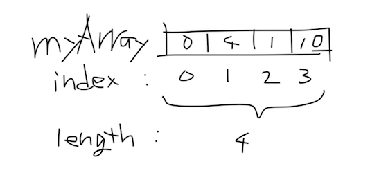

## 配列 Array

今までの変数は1対1で値を格納して使ってきましたが、複数の変数を格納したくなった時、配列（Array）を利用します。
同じ型の値をいくつも格納しておくことができます。配列は```[]```（各カッコ）で表します。

### 初期化

Processingの配列も```[]```で表現し、使うには初期化が必要です。

初期化の時にその配列の中に入る値の個数を決めておく必要があります。

```
int myArray[] = new int[2];
```

空の状態ではなく以下のように値を指定して初期化することもできます。

```
int myArray[] = {0, 4, 1, 10};
```

格納するには```[]```に配列の中の場所（インデックス）を指定して代入します。インデックスは0から始まります。

```
myArray[0] = 3;
```



### 値を取り出す

取り出すには```[]```にインデックスを指定します。

```
print(myArray[3]);
```

### 長さ

配列の長さは```.length```で取得できます。

```
for (int i = 0; i < myArray.length; i++) {
  println(myArray[i]);
}
```
