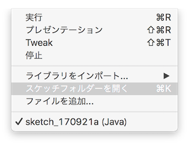
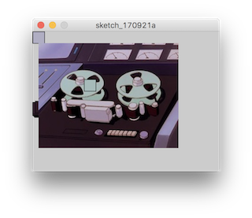
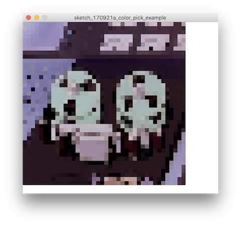

# 後期映像表現演習2-1

第一週目は主に座標を指定して図形を描くいわゆる所謂ベクターのグラフィックを扱ってきました。
二週目の今回は縦横にマス目状に敷き詰められたピクセル情報を扱ったグラフィックを扱って見ましょう。

## Image・ピクセルの操作

画像を読み込んで表示させます。PImageというクラスを使ってピクセルデータを操作していきます。
まずはskcketchフォルダと同じ階層にフォルダを新しく作り、'data'と名前をつけます。

メニューの```スケッチ```>>```スケッチフォルダーを開く```
で現在のスケッチのフォルダーを開けます。新しくフォルダをつけて```data```という名前をつけます。
```data```フォルダに使う画像ファイを置いておきます。



Processingのスケッチはこの名前のフォルダを基本にして、ローカルのファイルの読み込みなどを行います。
画像のロードには```loadImage()```関数を使います。```setup()```内で起動時に用意します。

引数には今作った```data```フォルダからの相対パスの文字列を指定します。

```
PImage photo;

void setup() {
  size(640, 480);
  photo = loadImage("myImage.jpg");
}
```

準備できたら```draw()```関数内で描画していきます。第1引数にPImageオブジェクト、第2、第３引数に画像のポジションを指定します。


```
void draw() {
  image(photo, 10, 20 );
}
```

## ピクセル情報の取得

```PImage```の```get()```関数で、画像データのピクセル情報を取得できます。座標を指定すると、RGカラー情報が帰ってきます。



マウスの座標でカラー情報を取得してみましょう。

```
void draw() {
  image(photo, 0, 0);
  
  color targetColor;
  target_color = photo.get(mouseX, mouseY);

  fill(targetColor);
  rect(mouseX, mouseY, 20, 20);
}
```

カラー情報からモザイクにしてみましょう。ピクセルを取得する座標を間引いてから、矩形の色に指定してタイル状に並べてみましょう。

### 二次元配列

今までは一次元の配列だけ扱っていましたが、ピクセルのように二次元に渡る配列を扱いたい場合、
```[]```各カッコをつなげて ```[][]``` のように配列の配列を表現できます。

ピクセル情報を扱う時によく出てきますので上手に使えると捗るでしょう。

```color```オブジェクトを格納する二次元配列を作ってみます。
```new```の後の初期化で各カッコの中に配列の長さを指定できます。

```
color[][] target_colors = new color[40][40]; // 40 x 40のカラーを格納するための二次元配列
```


```for```ループでピクセル情報を格納します。

```
  for (int i = 0; i< 40; i++) {
    for (int j = 0; j< 40; j++) {
      target_colors[j][i] = photo.get(j * scale_x, i * scale_y);
    }
  }
```

### カラーを取り出す

では```draw```関数の中で格納したピクセルのカラー情報を使って見ましょう。
格納した時と同じように、




```
PImage photo;
int division = 40;

color[][] target_colors = new color[division][division];

void setup() {
  size(640, 480);
  photo = loadImage("test.png");
  
  int scale_x = photo.width / division;
  int scale_y = photo.height / division;
  
  for (int i = 0; i< division; i++) {
    for (int j = 0; j< division; j++) {
      target_colors[i][j] = photo.get(j * scale_x, i * scale_y);
    }
  }
}

void draw() {
   fill(255);
   rect(0,0, width, height);
  
   for (int i = 0; i < division; i++) {
     for (int j = 0; j< division; j++) {
       color col = target_colors[i][j];
       fill(col);
       noStroke();
      
       pushMatrix();
       // scale(random(5), random(5));
         rect(0, 0, 10, 10);
       popMatrix();
      
       translate(10, 0);
       if (j == division - 1) {
         translate(-(10 * division), 0);
       }
     }
     translate(0, 10);
   }
}

```
