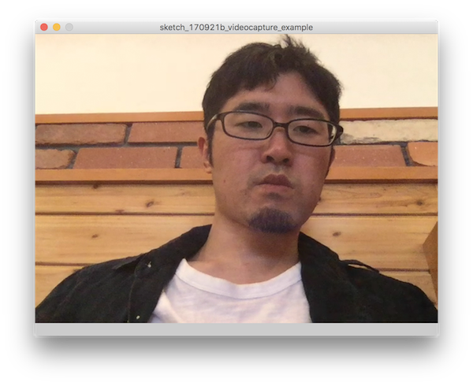

# 後期映像表現演習2-2

## ビデオの入力

システムのビデオソースを取得するために```Capture```というクラスを使用します。

Captureクラスは標準の```video```ライブラリが必要なので、一行目でimportします。

```import processing.video.*;```

続いてsetupで```Capture```を使う準備をします。```Capture.list()```で現在使用できるビデオストリームのリストを取得できるので、
setup時にいちどエラーコンソールにリストを文字列で表示してみましょう。

次に```Capture```をインスタンス化します。

```cam = new Capture(this, 1280,720, "FaceTime HD Camera");```

コンストラクタの引数の指定はいくつかありますが、今回は```width``` ```height``` ```デバイス名``` の順番で指定します。
コンソールに表示されたリストの中から、```size=````で表示されたサイズをそれぞれ ```width``` ```height```、 ```name=``` をデバイス名にします。


```
import processing.video.*;

Capture cam;

void setup() {
  String[] cameras = Capture.list();
  
  for (int i = 0; i < cameras.length; i++) {
    println(cameras[i]);
  }
    
  cam = new Capture(this, 1280, 720, "FaceTime HDカメラ（内蔵）");
  cam.start();           
}
```


