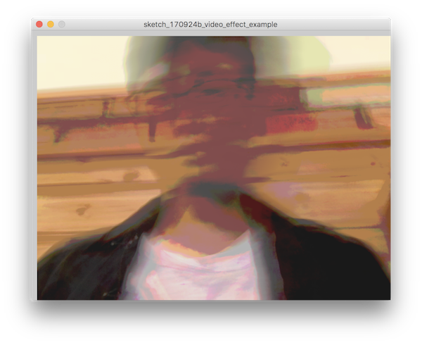

# 後期映像表現演習2-3

## ビデオエフェクト

ビデオの入力を取得できたところで、今度はフレームごとのピクセル情報にアクセスして、それを加工してみましょう。
取得できるのは各フレームのRGBの配列情報です。これに手を加えてビデオエフェクターのようなものを作ってみましょう。

まずは単純にカメラのピクセル情報にアクセスしてみましょう。


```
import processing.video.*;
 
Capture cam;
 
void setup() {
  size(640, 480);
 
  cam = new Capture(this, 640, 480, "FaceTime HD Camera");
  cam.start();
}
 
void draw() {
  if (cam.available()) {
    cam.read();
    image(cam, 0, 0);
  }
}
```

imageで書き込めるとがわかりました、このように画像データと同じような扱いでビデオのピクセル情報を利用できそうです。
ではPImageにピクセル情報を格納してみましょう。

### ピクセルデータの取得

まずは格納先の```PImage```を用意します。今回は画像ファイルからロードしないので```createImage```を使って初期化しておきましょう。

```my_image = createImage(640, 480, RGB);```

これで空の状態のPImageを用意できました。

ビデオのフレームデータが揃うタイミングを```cam.available()```で取得して新しいフレームが入ってきたかどうかをチェックしましょう。
描画のフレームのアップデートと、ビデオのフレームの読み込みは必ずしも同じタイミングではありません。もしまだビデをのデータあ揃っていないなら、
ピクセルへのアクセスはスキップするようにします。

```cam.read();```

準備ができたら、PImageの時のようにforループを使って各ピクセルにアクセスしていきます。


```image(my_image, 10, 10);```


```
import processing.video.*;
 
Capture cam;
color colors[];

PImage my_image; 

int num_pixels = 640 * 480 * 3;  

void setup() {
  size(640, 480);
  cam = new Capture(this, 640, 480, "FaceTime HD Camera");
  my_image = createImage(640, 480, RGB);
  loadPixels();
  cam.start();
}
 
void draw() {
  if (cam.available()) {
    cam.read();
 
    for (int i = 0; i < cam.height; i ++) {
      for (int j = 0; j < cam.width; j ++) {
        int loc = i * width + j;
        
        float r = red(cam.pixels[loc]);
        float g = green(cam.pixels[loc]);
        float b = blue(cam.pixels[loc]);
 
        my_image.pixels[i * cam.width + j] = color(r, g, b);
      }
    }
    my_image.updatePixels();
    
    image(my_image, 10, 10);
  }
}
```

### tint

```tint```関数で手軽にピクセルのカラー操作を行えます。tintは```colorMode```によって指定する値の意味が変わります。

```RGB```の場合は red, blur, green の成分を

```HSB```の時は hue, saturation, brightness の成分を操作します。

デフォルトではcolorModeは```RGB```になっています。


```
    my_image.updatePixels();
    
    tint(155, 20, 240);

    image(my_image, 10, 10);
```

alphaの値を操作してディレイのような効果。

```
tint(255, mouseX / (float)width * 255.0);
```




### ピクセルごとの操作

ピクセルが格納できたので、試しに前回使用したモザイク処理を入れてみましょう。
前回PImage使ったコードを改変して、ピクセルの情報で```rect()```ね塗りつぶして、タイル状に敷き詰めてみます。

```
import processing.video.*;
 
Capture cam;
color colors[];

PImage photo;

PImage my_image;

int scale_x, scale_y;

color[][] target_colors = new color[40][40];

int num_pixels = 640 * 480 * 3;  

void setup() {
  size(640, 480);
  cam = new Capture(this, 640, 480, "FaceTime HD Camera");
  my_image = createImage(640, 480, RGB);

  photo = createImage(640, 480, RGB);

  scale_x = photo.width / 40;
  scale_y = photo.height / 40;

  loadPixels();
  cam.start();
}
 
void draw() {
  if (cam.available()) {
    cam.read();
 
    for (int i = 0; i < cam.height; i ++) {
      for (int j = 0; j < cam.width; j ++) {
        int loc = i * width + j;
        
        float r = red(cam.pixels[loc]);
        float g = green(cam.pixels[loc]);
        float b = blue(cam.pixels[loc]);
 
        my_image.pixels[i * cam.width + j] = color(r, g, b);
      }
    }
    my_image.updatePixels();


    for (int i = 0; i< 40; i++) {
      for (int j = 0; j< 40; j++) {
        target_colors[j][i] = my_image.get(j * scale_x, i * scale_y);
      }
    }

    fill(255);
    rect(0,0, width, height);

    for (int i = 0; i < 40; i++) {
      for (int j = 0; j< 40; j++) {
        fill(target_colors[j][i]);
        noStroke();

        pushMatrix();
        rect(0, 0, 10, 10);
        popMatrix();

        translate(10, 0);
        if (j == 39) {
          translate(-400, 0);
        }
      }
      translate(0, 10);
    }
    image(photo, 10, 400 ); 
  }
}
```


