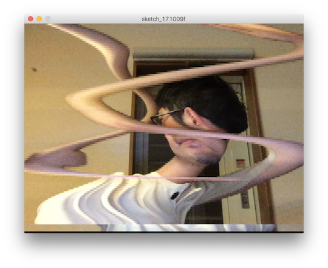

# 後期映像表現演習2-4

## ビデオのフレーム操作



今度は各フレームのピクセル情報をPImageの配列の中に格納（バッファ）してそのまま時間の記録として使って見ます。
キャプチャした映像のフレームを書き込み用PImageとそれを読み出して描画するためのPImaegeをそれぞれフレーム配列として
変数にしておきます。

```buffer_r``` から ```buffer_w``` にコピーをするときに、時間を少しずらしたものを部分的にコピーすることで、短冊状に時間がずれる効果にして見ます。

### setup内

それぞれ格納するPImageの変数を作ります。

```
PImage[] buffer_r;
PImage[] buffer_w;
```

記録しておくフレーム数

```int NUM_FRAMES = 120;```

時間差でコピーする短冊の幅も定数にしておきます。今回はheightをずらして横長の短冊にします。

```int IMAGE_HEIGHT = HEIGHT / NUM_FRAMES;```


現在書き込むフレーム番号を変数にしておきます。あとで```draw()```関数内で毎フレーム更新します。

```
int index_write = 0;
```

```setup()```内で読み出し用のバッファを```createImage```で初期化しておきます。

```
for (int i = 0; i < NUM_FRAMES; i++) {
    buffer_r[i] = createImage(WIDTH, IMAGE_HEIGHT, RGB);
}
```

### draw()内

```
cam.read();
buffer_w[index_write] = cam.get();
```

現在のカメラのフレームを```cam```を```read()```関数で読み込んだら、```get()```関数でPImageの配列に直接書き込みます。
この時書き込むフレーム番号を```index_write```で毎フレーム更新させるようにします。

次にそれぞれフレームをずらした短冊状のPImageを更新して行きます。PImageには```copy```という位置を指定してピクセル情報をコピーする関数が用意されています。

[https://processing.org/reference/PImage_copy_.html](https://processing.org/reference/PImage_copy_.html)


```for```ループを使って各読み出し用PImageの配列に、ずらしたフレームのピクセルをコピーして行きます。

```
for (int i = 0; i < NUM_FRAMES; i++) {
    if(buffer_w[i] != null){
      buffer_r[i].copy(buffer_w[i], 0, i * IMAGE_HEIGHT, WIDTH, 3, 0, 0, WIDTH, IMAGE_HEIGHT);
    }
}
```

同じループを使って短冊状の```buffer_r```を縦にずらして描画します。

```
image(buffer_r[i], 0 , i * IMAGE_HEIGHT);
```

描き終わったら```index_write```を更新しておきます。条件式でフレーム数を超えないように```０```に戻しておきましょう。


```
index_write++;
if(index_write >= NUM_FRAMES - 1)  {
  index_write = 0;
}
```

### コード全体

```
import processing.video.*;

Capture cam;
PImage[] buffer_r;
PImage[] buffer_w;

int WIDTH = 640;
int HEIGHT = 360;

int NUM_FRAMES = 120;
int IMAGE_HEIGHT = HEIGHT / NUM_FRAMES;

int index_write = 0;

void setup(){
  frameRate(30);
  size(640, 360);
  cam = new Capture(this, WIDTH, HEIGHT);
  cam.start();
  buffer_w = new PImage[NUM_FRAMES];
  buffer_r = new PImage[NUM_FRAMES];
  for (int i = 0; i < NUM_FRAMES; i++) {
    buffer_r[i] = createImage(WIDTH, IMAGE_HEIGHT, RGB);
  }
}

void draw() {
  if(cam.available()) {
    cam.read();
    buffer_w[index_write] = cam.get();
    
    for (int i = 0; i < NUM_FRAMES; i++) {
      if(buffer_w[i] != null){
        buffer_r[i].copy(buffer_w[i], 0, i * IMAGE_HEIGHT, WIDTH, 3, 0, 0, WIDTH, IMAGE_HEIGHT);
      }
   
      image(buffer_r[i], 0 , i * IMAGE_HEIGHT);
    }
    
    index_write++;
    if(index_write >= NUM_FRAMES - 1){
      index_write = 0;
    }
  }       
}
```


