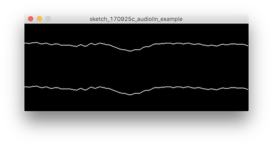

# 後期映像表現演習3-1

## オーディオの入力

Processingにはオーディオを扱うライブラリもいくつかあります。今回はMinimという豊富な機能を持ったライブラリを使って見ます。

Minim: [http://code.compartmental.net/tools/minim/](http://code.compartmental.net/tools/minim/)

オーディオデバイスにアクセスして、生のオーディオシグナルにアクセスしたり、音量やスペクトラムの解析、オシーレーターやシンセサイザーなどオーディオ信号をヴィジュアル表現に使うのには十分な機能を持っています。

 リファレンス＞ [http://code.compartmental.net/minim/](http://code.compartmental.net/minim/)

まずはライブラリのダウンロードをします。外部ライブラリはProcessingのIDEからパッケージマネージャーを使って簡単にダウンロードできます。

## Minimのインポート

まずメニューの```スケッチ```>>```ライブラリをインポート```から```ライブラリの追加```を選びます。

```Contribution Manager```というウィンドウが開くのでここからライブラリのインストールをします。

検索フォームに```Minim```とうちます。```Minim```を選択して```↓instal```でインストールします。


Munimインスタンスを作りを初期化します。

```
Minim minim;

minim = new Minim(this);
```

```AudioInput```クラスはオーディオの入力信号をモニターします。

初期化するときに、オーディオのタイプ```Minim.MONO``` か ```Minim.STEREO```を
第二引数にはバッファサイズを指定します。

```
audio_in = minim.getLineIn(Minim.STEREO, 512);
```

これでオーディオの入力にアクセスする準備は整いました。

ではバッファーの分の点を書いてオーディオ入力の波形を見てみます。

```audio_in```の```left``` / ```right```で左右のチャンネルのバッファにそれぞれアクセスできます。

```get()```関数でバッファのインデックスを指定して入力信号を取得します。


```
audio_in.left.get(buffer_index_number);
audio_in.right.get(buffer_index_number);
```




```
import ddf.minim.*;
 
Minim minim;
AudioInput audio_in;
int graph_height = 100;
 
void setup() {
  size(512, 200);
 
  minim = new Minim(this);
 
  audio_in = minim.getLineIn(Minim.STEREO, 512);
}


void draw() {
  background(0);
  stroke(255);
 
  for(int i = 0; i < audio_in.bufferSize() - 1; i++)
  {
    point(i, 50 + audio_in.left.get(i) * graph_height);
    point(i, 150 + audio_in.right.get(i) * graph_height);
  }
}
```


### グラフィックに使ってみる

オーディオ入力をVJに使用する例：Rogue Idiot | Real-time GPU Live-coding by hexler

[https://vimeo.com/218416385](https://vimeo.com/218416385)


オーディオの入出力ができたので、それをヴィジュアル表現に使って見ましょう。

単純な図形の大きさに振幅の大きさを適応させてみます。


```
import ddf.minim.*;
 
Minim minim;
AudioInput audio_in;

float radius = 500;

float before_amplitude;
 
void setup() {
  size(640, 480);
 
  minim = new Minim(this);
 
  audio_in = minim.getLineIn(Minim.STEREO, 512);
}


void draw() {
    background(255);

    float amplitude = audio_in.left.get(0);

    noStroke();
    fill(0, 0, 255);

    float filter_rate = 0.25; 
    float amp = amplitude * filter_rate + before_amplitude * (1.0 - filter_rate);

    ellipse(320, 240, amp * radius, amp * radius);

    before_amplitude = amp;
}
```

### ローパスフィルター

1フレーム前の値を保存しておいて、使うときに現在の値との勾配をかけて使うとローパスフィルターになります。
周波数の高い波形をカットしたいときに便利です。

```
float before_amplitude;
```

```
float filter_rate = 0.1; // それぞれの値にかける勾配 
float amp = amplitude * filter_rate + before_amplitude * (1.0 - filter_rate);

// ampを使って何か処理

before_amplitude = amplitude;
```
