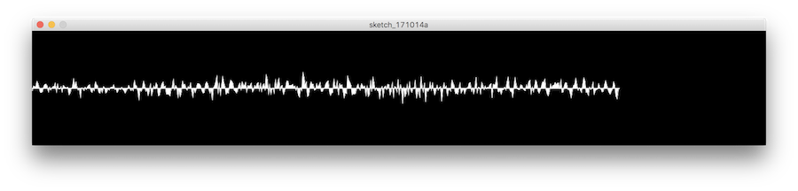
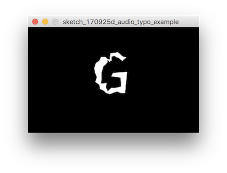

# 後期映像表現演習3-2

## サウンドインタラクション

### PShapeを使ったオーディオグラフ



Pshapeを使って書いてみましょう。

```createShape()```関数でからのPShapeを作ります。

作り終えたらforループを使って座標情報を追加していきます。

```
shape.vertev();
```

ループがはじめる前に```beginShape()```
ループの最後に```endShape()```
を呼びます。これでパスで囲われた図形としてPShapeを準備できます。


### PVector

今まで座標を指定するときに、関数の引数にx, yそれぞれの値を別に指定していました。
それらをまとめめて一つのオブジェクトとして管理するために便利なクラスPVectorを使いましょう。

```PVector point = new PVector(x, y);```

PVectorはベクトル計算をするのにも役立ちます。ベクトル同士の合成なども簡単に行えます。


座標を追加できたら、```shape()```関数を使って描画します。

```
import ddf.minim.*;

Minim minim;
AudioInput audio_in;

int buf_num = 512;

PShape shape;

float graph_height = 150;
 
void setup() {
  size(1280, 200);
 
  minim = new Minim(this);
 
  audio_in = minim.getLineIn(Minim.STEREO, buf_num);
}


void draw() {
  background(0);
  stroke(255);
  
  shape = createShape();
  shape.beginShape();
  
  for(int i = 0; i < buf_num; i++) {
    float amp_ = audio_in.left.get(i);
    PVector point = new PVector(2 * i, 100 - amp_ * graph_height);
    shape.vertex(point.x, point.y);
  }
  
  shape.vertex(buf_num * 2, 100);
  shape.vertex(0, 100);
  
  shape.endShape();
  
  shape(shape);
}
```


## サウンドタイポグラフィー



今度は取得したバッファーデータをPShapeの座標の移動に使ってみましょう。
フォントデータをPShpeに読み込んで、PShapeのそれぞれの座標をオーディオの振幅でダイナミックに動くようにしてみましょう。


テキストのデータ用のPShapeを用意しておいて、
それを読み出してオーディオの信号と足し合わせたものを格納するPShapeを```draw()```関数内でまいフレーム作ります。

```
// draw内で毎フレーム描画用のPShapeを用意

PShape dest_shape;
  
dest_shape = createShape();
```

テキストのPShapeから座標を読み出してオーディオのデータと足し合わせるのを同じforループで行ってみます。

```
for (int i = 0; i < text_shape.getVertexCount() - 1; i++) {
  PVector v = text_shape.getVertex(i);

  float val = audio_in.left.get(i) * graph_height;

  dest_shape.vertex(v.x, v.y + val);
}

```

dest_shapeの座標を指定するときにオーディオの波形情報をy方向に足して指定してみます。

```dest_shape.vertex(v.x, v.y + val);```

できたら```endShape()```して```shape()```関数で描画します。


### 直角を得る

縦方向に波形を加えることは成功しました。
では文字の輪郭に沿って、外側に波形が伸びてゆくようにするのはどうすればよいでしょうか。

直前の座標を今の座標、二つの座標から直角をなす座標を求める計算をして、その方向にオーディオ信号が伸びてゆくようにします。

直角を得るにはPVectorの```cross()```関数が役に立ちます。


二点のPVectorから直角のベクトルを求める```getNormal()```関数を用意したのでそれを利用します。


```
PVector dest = getNormal(base, next)
```

destには```base```と```next```の2点のなす直角のベクトルが帰ります。

あとはPVectorの関数```mul()```でベクトルを乗算して振幅させるようにします。

destを計算したとき、直下鵜のベクトルは原点からのベクトルなので、
```base```の座標を足してあげて、文字の輪郭部分まで移動させてあげます。

ここでPVectorの```add()```関数が役立ちます。


### コード（全体）

```
import ddf.minim.*;

Minim minim;
AudioInput audio_in;

PFont font;
PShape text_shape;

float graph_height = 150;
 
void setup() {
  size(340, 210);
 
  minim = new Minim(this);
 
  audio_in = minim.getLineIn(Minim.STEREO, 512);
   
  font = createFont("SourceCodePro-Regular.ttf", 120);
  
  text_shape = font.getShape('G', 1);
}


void draw() {
  background(0);
  stroke(255);
 
  PShape dest_shape;
  
  dest_shape = createShape();
  
  translate(130, 130);
  dest_shape.beginShape();

  for (int i = 0; i < text_shape.getVertexCount() - 1; i++) {
    PVector v = text_shape.getVertex(i);
    PVector v_b = text_shape.getVertex(i + 1);
    
    float x_ = v.x;
    float y_ = v.y;
    
    float x_b = v_b.x;
    float y_b = v_b.y;
    
    float val = audio_in.left.get(i * 10) * graph_height;
    
    PVector base = new PVector(x_, y_);
    PVector next = new PVector(x_b, y_b);
    
    PVector dest = getNormal(base, next).mult(val).add(base);
  
    dest_shape.vertex(dest.x, dest.y);
  }
  
  dest_shape.endShape();
  
  shape(dest_shape);
}

PVector getNormal(PVector currentPoint, PVector nextPoint) {
  PVector vAB = nextPoint.copy().sub(currentPoint).normalize();
  PVector vAZ = new PVector(0, 0, 1);
  PVector normalVec = vAB.cross(vAZ);
  return normalVec;
}
```
