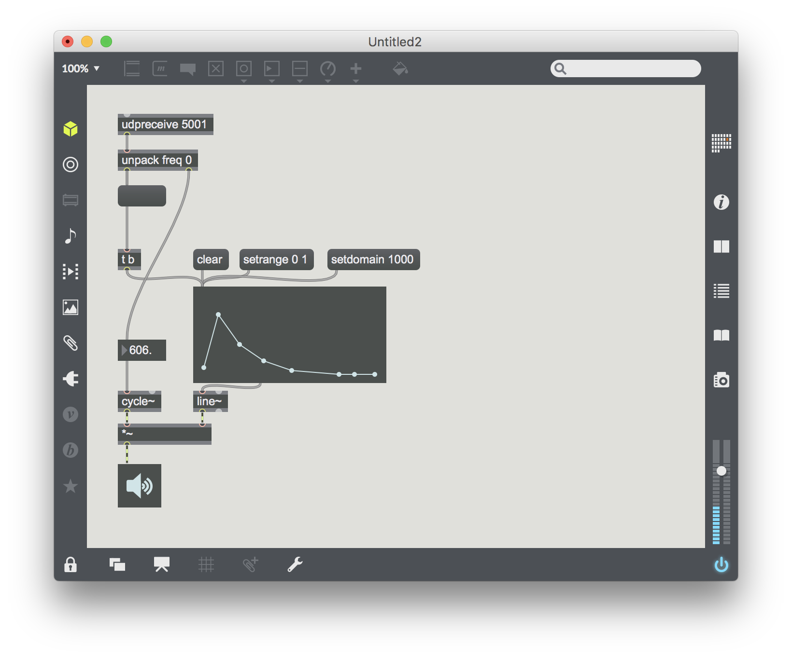

# 後期映像表現演習3-3

## OSC他のアプリケーションとの連携

OSC (Open Sound Control) と呼ばれるプロトコルを使って同じマシン内の
違ったアプリケーション間で通信してみます。


### IPアドレス

ネットワークにつながれたコンピューターには必ずIPと呼ばれるアドレス番号が割り振られます。
通常IPv4と呼ばれるドットで区切った4つの正数が割り振られます。

### ループバックアドレス

自身のパソコンを表す特別に予約されたIPあります。

```127.0.0.1```

ホスト名で文字列で指定することもあります。これも予約された特別なアドレスです。

```localhost```

### TCP / UDP


### メッセージ


### メッセージの送信



```
import oscP5.*;
import netP5.*;

OscP5 oscP5;

Boolean bang = false;

void setup() {
  size(640, 480);
  oscP5 = new OscP5(this,5000);
}

void draw() {
  if(bang){
    fill(255, 255);
    bang = false;
  } else {
    fill(0, 20);
  }
  rect(0, 0, width, height);
}


void oscEvent(OscMessage msg) {

  if(msg.checkAddrPattern("/test")) {

    int value = msg.get(0).intValue(); 
    if (1 <= value) {
      bang = true;
    };
    println("message at /test", value + 120);
  }
}
```


