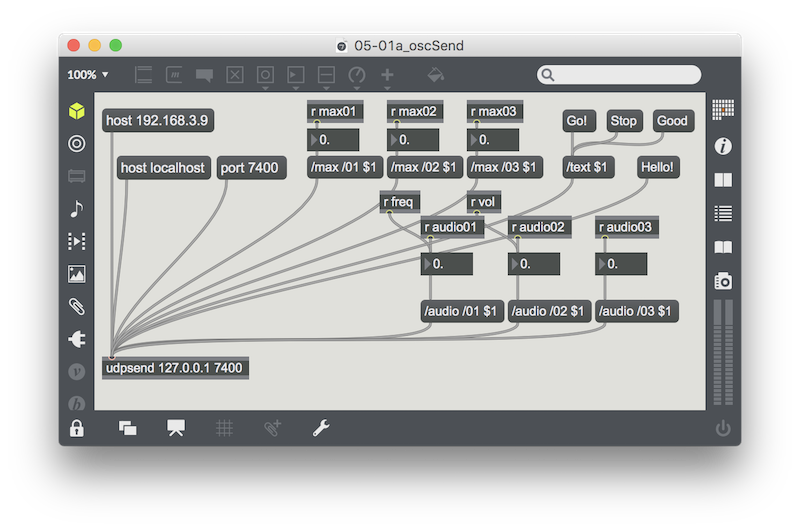

# 後期映像表現演習3-4

## OSC他のアプリケーションとの連携2

### OSCの受信

今度はProcessing側で受信を行います。
Max/MSPから```/max```アドレスにパケットを送ってProcessing側で受け取ります。



Max側では```updsend```オブジェクトに送信先のIPとポート番号を指定して送信します。
第一引き数にメッセージboxで値を送信するごとにパケットとして送信されます。

```/max```アドレスに値を一つ入れて送信してみます。


### oscEvent()


Processing側では```OscP5```のインスタンスをポート番号で初期化した後、
グローバルスコープに```oscEvent()```kん数を自分で用意しておきます。
これは、OSCのメッセージがパケットを受信した時に呼ばれる```OscP5```の特別な関数です。

ここに受信した時のパケットを取り出すコードと、受信した時の処理を書いておきます。

```
void oscEvent(OscMessage msg) {

}
```

パケットのアドレスをチェックします。```checkAddrPattern()```関数を使うと、パケットのアドレスがマッチした時だけ処理を行うようにしておけます。これでアドレスごとの処理を場合分けしておくことができます。

```
if (msg.checkAddrPattern("/max")) {

  // パケットが/testアドレスだった時

}
```

### 値の取り出し

```get()```関数で値を取り出す値のインデックス番号を指定します。
```get()```で取り出した値を、型の種類によって整形する関数が用意されています。今回はintの値なので```intValue()```でintの値にして変数に割り当ててあげます。

送信側と受信側でアドレス以降の値の位置、値の型をあらかじめ合わせておく必要があります。

今回は```/max```アドレスの後に値が一つ、intの値で入っているパケットをMax側・Processing側で合わせています。

```
if(msg.checkAddrPattern("/max")) {

  int value = msg.get(0).intValue(); 

  println("message at /max", value + 120);
}

```

### コード全体

```
import oscP5.*;
import netP5.*;

OscP5 oscP5;

Boolean bang = false;

void setup() {
  size(640, 480);
  oscP5 = new OscP5(this, 5000);
}

void draw() {
  if(bang){
    fill(255, 255);
    bang = false;
  } else {
    fill(0, 20);
  }
  rect(0, 0, width, height);
}


void oscEvent(OscMessage msg) {
  if(msg.checkAddrPattern("/max")) { // 一つ目のアドレスのチェック
    String addr = msg.get(0).stringValue();
    float value = msg.get(1).floatValue();
    
    if (addr.equals("/01")) { // 二つ目のアドレスのチェック
      if (1 <= value) {
        bang = true;
      };
    
      println("message at ::", addr, value);
    }
  }
}
```


### 値をつかって描画する

Maxからの値を描画に使ってみましょう。


Max側で送信する値を```yPos```として

円を描いて画面の右へ移動する```Particle```クラスを用意して、初期化の時にx, yのポジションを指定できるようにしておきます。

```oscEvent()```で```/yPos```アドレスに受信したら、パーティクルの```ArrayList```に一つ```Particle```を追加するうにしましょう。その際```/yPos```で受け取った値を```Particle```の```y```座標として使ってみます。


```
void oscEvent(OscMessage msg) {

  if(msg.checkAddrPattern("/yPos")) {

    int value = msg.get(0).intValue(); 
    
    part.add(new Particle(0, value));
    
    println("message at /yPos", value + 120);
  }
}
```


#### Particleクラス

```
class Particle {
  float x, y;
  Particle(float x_, float y_) {
    x = x_;
    y = y_;
  }
  void draw() {
    ellipse(x, y, 10, 10);
    x++;
    if (x > width) {
      
      part.remove(this);
      println("delete..", part.size());
    }
  }
}
```


#### コード全体

```
import oscP5.*;
import netP5.*;

OscP5 oscP5;

NetAddress remoteServer;

ArrayList<Particle> part = new ArrayList<Particle>();

void setup() {
  size(640, 480);
  
  oscP5 = new OscP5(this, 5000);

  remoteServer = new NetAddress("127.0.0.1", 7400);
}

void draw() {
  background(255);
  
  for(int i = 0; i < part.size(); i++) {
    part.get(i).draw();
  }
}

void oscEvent(OscMessage msg) {

  if(msg.checkAddrPattern("/yPos")) {

    int value = msg.get(0).intValue(); 
    
    part.add(new Particle(0, value));
    
    println("message at /yPos", value + 120);
  }
}
```
